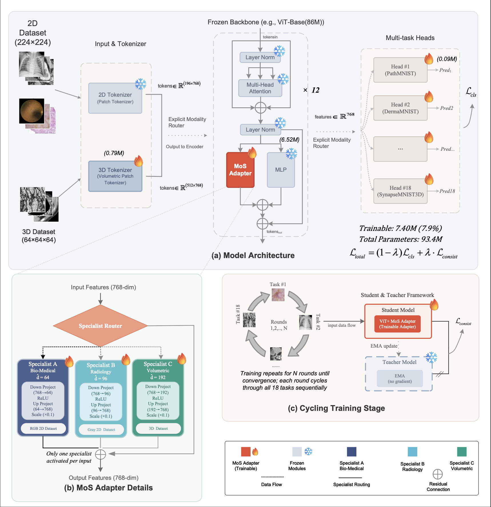

# MOSAIC-MedMNIST

<p align="center">
  <a href="LICENSE"></a>
  <a href="https://conferences.miccai.org/2026"></a>
  <a href="https://www.python.org"></a>
  <a href="https://pytorch.org"></a>
  <a href="https://github.com/BurkeBelle/MOSAIC-MedMNIST/stargazers"></a>
</p>

***Bridging Heterogeneous Medical Datasets via Mixture-of-Specialists Adapters for Unified Medical Image Classification***

*Accepted at MICCAI 2026*

---

## Table of Contents

- [Overview](#overview)
- [Architecture](#architecture)
- [Installation](#installation)
- [Data Preparation](#data-preparation)
- [Training](#training)
- [Evaluation](#evaluation)
- [Implementation Details](#implementation-details)
- [Results](#results)
- [Project Structure](#project-structure)
- [Citation](#citation)
- [Acknowledgements](#acknowledgements)
- [License](#license)

---

## Overview

MOSAIC trains one model on all 18 MedMNIST datasets (12 2D + 6 3D) — not 18 separate ones. The core problem: naïvely sharing a single backbone across diverse medical tasks causes performance to drop (we call this cross-task interference). MOSAIC reduces it with three domain-specific adapters plugged into a frozen ViT-Base, each handling a different imaging modality (Bio-Medical RGB / Radiology grayscale / 3D volumetric). A cyclic training loop borrowed from Ark+ prevents forgetting across datasets.

<div align="center">

| | |
|:---|:---|
| **Trainable Params** | 7.40M (7.9% of ViT-Base) |
| **Accuracy** | 84.16 ± 0.21% |
| **AUC** | 89.63 ± 0.24 |
| **Datasets** | 18 (12 2D + 6 3D) |
| **Checkpoint** | 1 unified model |

</div>

## Architecture

<p align="center">
  
</p>

> Vector version: [architecture.pdf](figures/architecture.pdf)

**Deterministic Three-Expert Routing:**

<div align="center">

<table>
  <tr>
    <th>Expert</th>
    <th>Modality</th>
    <th>Datasets</th>
    <th>Bottleneck</th>
  </tr>
  <tr>
    <td><b>A</b> (Bio-Medical)</td>
    <td>RGB, microscopic texture</td>
    <td>PathMNIST, BloodMNIST, TissueMNIST, DermaMNIST, RetinaMNIST</td>
    <td align="center">64</td>
  </tr>
  <tr>
    <td><b>B</b> (Radiology)</td>
    <td>Grayscale, macro geometry</td>
    <td>ChestMNIST, PneumoniaMNIST, BreastMNIST, OCTMNIST, OrganAMNIST, OrganCMNIST, OrganSMNIST</td>
    <td align="center">96</td>
  </tr>
  <tr>
    <td><b>C</b> (Volumetric)</td>
    <td>3D voxel, spatial structure</td>
    <td>OrganMNIST3D, NoduleMNIST3D, AdrenalMNIST3D, VesselMNIST3D, FractureMNIST3D, SynapseMNIST3D</td>
    <td align="center">192</td>
  </tr>
</table>

</div>
Each dataset is assigned to exactly one specialist adapter based on imaging modality. This routing is fixed before training and does not involve learned gating. Note that this is not the only valid grouping: datasets could also be split by anatomy, resolution, or task type (binary vs. multi-class), which may yield different routing tables. We chose modality-based routing because it aligns with the most salient visual differences across datasets (color space, spatial dimensionality, texture statistics).

## Installation

```bash
git clone https://github.com/BurkeBelle/MOSAIC-MedMNIST.git
cd MOSAIC-MedMNIST

conda create -n mosaic python=3.9 -y
conda activate mosaic
pip install -r requirements.txt
```

## Data Preparation

### 1. MedMNIST (Main Experiments — 18 Datasets)

Download all 18 MedMNIST datasets (224×224 for 2D, 64×64×64 for 3D). Both 2D and 3D datasets are stored under `data_224/` for unified loading:

```python
import medmnist
from medmnist import INFO

# 2D datasets (12)
for name in ['pathmnist', 'dermamnist', 'octmnist', 'pneumoniamnist',
             'chestmnist', 'breastmnist', 'bloodmnist', 'tissuemnist',
             'retinamnist', 'organamnist', 'organcmnist', 'organsmnist']:
    DataClass = getattr(medmnist, INFO[name]['python_class'])
    DataClass(split='train', download=True, root='./data_224', size=224, as_rgb=True)

# 3D datasets (6)
for name in ['organmnist3d', 'nodulemnist3d', 'adrenalmnist3d',
             'vesselmnist3d', 'fracturemnist3d', 'synapsemnist3d']:
    DataClass = getattr(medmnist, INFO[name]['python_class'])
    DataClass(split='train', download=True, root='./data_224', size=64)
```

Data directory structure:

```
./data_224/
├── pathmnist.npz
├── dermamnist.npz
├── ...
├── organmnist3d.npz
└── synapsemnist3d.npz
```

### 2. MedIMeta (2D External Validation)

Five 2D medical image datasets from [MedIMeta Benchmark](https://huggingface.co/datasets/MedIMeta/MedIMeta):

```bash
pip install datasets

python -c "
from datasets import load_dataset
for ds_name in ['bus', 'fundus', 'glaucoma', 'mammo_calc', 'mammo_mass']:
    ds = load_dataset('MedIMeta/MedIMeta', ds_name)
    print(f'{ds_name}: {ds}')
"
```

Data directory structure:

```
./Data_MedIMeta/
├── bus/
│   ├── train/
│   ├── val/
│   └── test/
├── fundus/
├── glaucoma/
├── mammo_calc/
└── mammo_mass/
```

### 3. MosMedData (3D External Validation)

COVID-19 chest CT dataset (1,110 cases, 5 severity classes) from [MosMedData](https://mosmed.ai/datasets/covid19_1110).

Download from Kaggle:

```bash
pip install kagglehub

python -c "
import kagglehub
path = kagglehub.dataset_download('mathurinache/mosmeddata-chest-ct-scans-with-covid19')
print(f'Dataset downloaded to: {path}')
"
```

Or download directly: https://www.kaggle.com/datasets/mathurinache/mosmeddata-chest-ct-scans-with-covid19

Raw data structure (NIfTI format, ~25 GB):

```
MosMedData/
├── CT-0/       # Normal (254 cases)
├── CT-1/       # Mild (684 cases)
├── CT-2/       # Moderate (125 cases)
├── CT-3/       # Severe (45 cases)
└── CT-4/       # Critical (2 cases)
```

Preprocess to 64×64×64 volumes:

```bash
python preprocess_mosmed.py
```

Processed output (~1.1 GB):

```
MosMedData/processed_64/
├── train.npy           # (888, 64, 64, 64)
├── train_labels.npy    # (888,)
├── test.npy            # (222, 64, 64, 64)
├── test_labels.npy     # (222,)
└── data_split.json
```

## Pretrained Weights

Download the ViT-Base (ImageNet-21k) pretrained weights:

```bash
wget https://storage.googleapis.com/vit_models/imagenet21k/ViT-B_16.npz -O vit_base_patch16_224.npz
```

## Training

### MOSAIC (proposed method)

```bash
python train.py \
    --data_root ./data_224 \
    --pretrained ./vit_base_patch16_224.npz \
    --adapter_mode v2_moe \
    --adapter_bottleneck_a 64 \
    --adapter_bottleneck_b 96 \
    --adapter_bottleneck_c 192 \
    --freeze_backbone \
    --num_rounds 50 \
    --batch_size 32 \
    --lr 1e-4 \
    --ema_momentum 0.9 \
    --ema_momentum_3d 0.95 \
    --consist_weight 0.1 \
    --early_stopping_patience 5 \
    --seed 42 \
    --output_dir ./output/mosaic_seed42

# Reproduce paper results (3 seeds)
for SEED in 42 123 456; do
    python train.py \
        --data_root ./data_224 \
        --pretrained ./vit_base_patch16_224.npz \
        --adapter_mode v2_moe \
        --adapter_bottleneck_a 64 \
        --adapter_bottleneck_b 96 \
        --adapter_bottleneck_c 192 \
        --freeze_backbone \
        --num_rounds 50 \
        --batch_size 32 \
        --lr 1e-4 \
        --ema_momentum 0.9 \
        --ema_momentum_3d 0.95 \
        --consist_weight 0.1 \
        --early_stopping_patience 5 \
        --seed $SEED \
        --output_dir ./output/mosaic_seed${SEED}
done
```

### Ablation: V1 dual-channel adapter

```bash
python train.py \
    --adapter_mode v1 \
    --freeze_backbone \
    --pretrained ./vit_base_patch16_224.npz \
    --num_rounds 50 \
    --ema_momentum 0.9 \
    --ema_momentum_3d 0.95 \
    --output_dir ./output/v1_seed42
```

### Ablation: 2D-3D interleaved training order

```bash
python train.py \
    --adapter_mode v2_moe \
    --adapter_bottleneck_c 192 \
    --use_interleaved \
    --freeze_backbone \
    --pretrained ./vit_base_patch16_224.npz \
    --num_rounds 50 \
    --ema_momentum 0.9 \
    --ema_momentum_3d 0.95 \
    --output_dir ./output/interleaved_seed42
```

### PEFT Baselines (LoRA / VPT)

```bash
# Run all 4 configurations (LoRA/VPT × Independent/Joint) with one seed
python train_baseline.py \
    --run_all --seeds 42 \
    --data_root ./data_224 \
    --pretrained ./vit_base_patch16_224.npz \
    --output_dir ./output_baseline

# Run all 4 configurations × 3 seeds (full reproduction)
python train_baseline.py \
    --run_all --seeds 42 123 456 \
    --data_root ./data_224 \
    --pretrained ./vit_base_patch16_224.npz \
    --output_dir ./output_baseline

# LoRA rank sweep (matched-budget comparison)
# r=8 uses default: --lora_rank 8 --lora_alpha 16
python train_baseline.py --mode joint --adapter lora \
    --lora_rank 48 --lora_alpha 96 --seed 42 \
    --data_root ./data_224 --pretrained ./vit_base_patch16_224.npz \
    --output_dir ./output_lora_r48

python train_baseline.py --mode joint --adapter lora \
    --lora_rank 192 --lora_alpha 384 --seed 42 \
    --data_root ./data_224 --pretrained ./vit_base_patch16_224.npz \
    --output_dir ./output_lora_r192
```

## Evaluation

```bash
python test.py --checkpoint ./output/mosaic_seed42/best_model.pth --data_root ./data_224
```

## Implementation Details

<div align="center">

<table>
  <tr>
    <th>Category</th>
    <th>Parameter</th>
    <th>Value</th>
  </tr>
  <tr>
    <td rowspan="3"><b>Backbone</b></td>
    <td>Model</td>
    <td>ViT-Base/16</td>
  </tr>
  <tr>
    <td>Pretrained</td>
    <td>ImageNet-21k (.npz)</td>
  </tr>
  <tr>
    <td>Freeze</td>
    <td>✓</td>
  </tr>
  <tr>
    <td rowspan="5"><b>Adapter</b></td>
    <td>Mode</td>
    <td>v2_moe (3 experts)</td>
  </tr>
  <tr>
    <td>Expert A (Bio-Medical)</td>
    <td>bottleneck = 64</td>
  </tr>
  <tr>
    <td>Expert B (Radiology)</td>
    <td>bottleneck = 96</td>
  </tr>
  <tr>
    <td>Expert C (Volumetric)</td>
    <td>bottleneck = 192</td>
  </tr>
  <tr>
    <td>Scale</td>
    <td>0.1</td>
  </tr>
  <tr>
    <td rowspan="2"><b>EMA</b></td>
    <td>2D Momentum</td>
    <td>0.9</td>
  </tr>
  <tr>
    <td>3D Momentum</td>
    <td>0.95</td>
  </tr>
  <tr>
    <td rowspan="2"><b>Loss</b></td>
    <td>Consistency Weight</td>
    <td>0.1</td>
  </tr>
  <tr>
    <td>Total Loss</td>
    <td>L_cls + 0.1 × L_consist</td>
  </tr>
  <tr>
    <td rowspan="6"><b>Training</b></td>
    <td>Rounds</td>
    <td>50 (early stopping)</td>
  </tr>
  <tr>
    <td>Batch Size</td>
    <td>32</td>
  </tr>
  <tr>
    <td>Learning Rate</td>
    <td>1e-4</td>
  </tr>
  <tr>
    <td>Optimizer</td>
    <td>AdamW (weight_decay=0.01)</td>
  </tr>
  <tr>
    <td>LR Schedule</td>
    <td>Linear warmup (5 rounds) + Cosine</td>
  </tr>
  <tr>
    <td>Early Stopping</td>
    <td>5 rounds patience</td>
  </tr>
  <tr>
    <td><b>Seeds</b></td>
    <td></td>
    <td>42, 123, 456</td>
  </tr>
</table>

</div>

**Trainable Parameter Breakdown:**

<div align="center">

<table>
  <tr>
    <th>Component</th>
    <th align="right">Params</th>
  </tr>
  <tr><td>3D Tokenizer</td><td align="right">0.40M</td></tr>
  <tr><td>Expert A × 12 layers</td><td align="right">1.19M</td></tr>
  <tr><td>Expert B × 12 layers</td><td align="right">1.78M</td></tr>
  <tr><td>Expert C × 12 layers</td><td align="right">3.55M</td></tr>
  <tr><td>18 Classification Heads</td><td align="right">0.13M</td></tr>
  <tr><td><b>Total Trainable</b></td><td align="right"><b>~7.40M (7.9%)</b></td></tr>
</table>

</div>

**Per-Seed Results:**

<div align="center">

| Seed | ACC (%) |
|:----:|:-------:|
| 42 | 84.46 |
| 123 | 83.97 |
| 456 | 84.05 |
| **Mean ± Std** | **84.16 ± 0.26** |

</div>

### PEFT Baseline Settings

All baselines share the same frozen ViT-Base/16 backbone, tokenizer, and evaluation protocol as MOSAIC.

**Independent mode** (18 separate models, one per dataset):

<div align="center">

| Parameter | Value |
|:----------|:------|
| Optimizer | AdamW |
| Learning Rate | 1e-3 |
| Weight Decay | 0.01 |
| Max Epochs | 50 |
| Early Stopping | patience = 10 |
| Scheduler | CosineAnnealingLR |
| Batch Size | 32 |
| Teacher-Student | None |

</div>

**Joint mode** (single shared model, cyclic training — used for LoRA-Joint and VPT-Joint baselines):

<div align="center">

| Parameter | Value |
|:----------|:------|
| Optimizer | AdamW |
| Learning Rate | 1e-4 |
| Weight Decay | 0.01 |
| Max Rounds | 72 |
| Early Stopping | patience = 5 |
| Warmup | 5 rounds (linear 0.01→1.0) |
| Scheduler | Linear warmup + Cosine |
| Batch Size | 32 |
| Consistency Loss | MSE, weight = 0.1 |
| EMA Momentum | 0.999 |
| Gradient Clipping | max_norm = 1.0 |

</div>

> **Note:** Baselines use 72 rounds (vs. MOSAIC's 50) and EMA momentum 0.999 (vs. MOSAIC's 0.9/0.95). These are tuned separately for baseline convergence; MOSAIC uses lower momentum to allow faster adaptation across heterogeneous tasks.

**LoRA configuration:** rank = 8, alpha = 16 (applied to Q and V projections). Rank sweep: r ∈ {8, 48, 192} with alpha = 2r. The default `--run_all` command uses r=8; see Training section for rank sweep commands.

**VPT configuration:** VPT-Deep with 10 prompt tokens per layer, independent across layers, trunc_normal init (std=0.02).

## Results

### Main Results (Table 1)

Performance on 18 MedMNIST datasets (mean ± std over 3 seeds):

<div align="center">

| Method | Split | ACC (%) | AUC (%) |
|:-------|:-----:|:-------:|:-------:|
| Official (ResNet-18) | All | 80.32 | 89.92 |
| Single-task (ViT-B) | All | 81.86±0.38 | 87.81±0.07 |
| Joint baseline (ViT-B) | All | 77.66±0.66 | 84.55±0.35 |
| **MOSAIC (Ours)** | **All** | **84.16±0.21** | **89.63±0.24** |
| | 2D | 88.78±0.28 | 95.24±0.09 |
| | 3D | 74.93±0.27 | 78.41±0.91 |

</div>

### Matched-Budget PEFT Comparison (Table 2)

<div align="center">

| Method | Training | #Models | Trainable | ACC (%) | AUC (%) |
|:-------|:--------:|:-------:|:---------:|:-------:|:-------:|
| LoRA (r=8) | Independent | 18 | 5.40M | 85.50±0.05 | 88.75±0.34 |
| VPT (P=10) | Independent | 18 | 1.80M | 83.83±0.45 | 86.73±1.22 |
| VPT (P=10) | Joint | 1 | 0.18M | 78.01±0.24 | 85.45±0.48 |
| LoRA (r=8) | Joint | 1 | 0.38M | 80.02±0.42 | 86.69±0.60 |
| LoRA (r=192) | Joint | 1 | 7.08M | 81.01±0.25 | 87.89±0.73 |
| **MOSAIC (Ours)** | **Joint** | **1** | **7.40M** | **84.16±0.21** | **89.63±0.24** |

</div>

Why not just train 18 LoRA models? You can. LoRA-Independent (r=8) hits 85.50%, higher than MOSAIC's 84.16%. But that's 18 separate checkpoints. MOSAIC is one. Past ~25 datasets, MOSAIC's total parameter cost is actually lower. Also worth noting: scaling LoRA rank from 8 to 192 (24×) only gains ~1% accuracy, which suggests the real problem isn't model capacity, it's interference between tasks. That's exactly what expert routing is designed to fix.

## Project Structure

```
MOSAIC-MedMNIST/
├── train.py                  # MOSAIC training entry point
├── train_baseline.py         # PEFT baseline experiments (LoRA / VPT)
├── test.py                   # Checkpoint evaluation
├── setup.sh                  # Environment setup & data download
├── run.sh                    # Reproduce paper results (3 seeds)
├── config/
│   └── datasets.py           # Dataset configs & expert routing table
├── dataloader/
│   ├── medmnist_loader.py    # MedMNIST data loading (2D & 3D)
│   └── transforms.py         # 2D/3D augmentations (intensity-only for 3D)
├── model/
│   ├── adapter.py            # AdaptFormer adapter & MoE adapter
│   ├── patch_embed.py        # Unified 2D/3D patch embedding
│   ├── transformer_block.py  # ViT block with parallel adapter
│   ├── unified_model.py      # MOSAIC model & teacher (EMA)
│   ├── lora_adapter.py       # LoRA baseline
│   ├── vpt_adapter.py        # VPT-Deep baseline
│   └── baseline_model.py     # Baseline model factory
├── engine/
│   ├── trainer.py            # Cyclic training loop (Ark+ style)
│   └── evaluator.py          # Multi-metric evaluation (ACC, AUC)
├── external_eval/            # External validation experiments
│   ├── configs.py            # 2D external dataset configs (MedIMeta)
│   ├── configs_3d.py         # 3D external dataset configs (MosMedData)
│   ├── dataset.py            # 2D external dataset loader
│   ├── dataset_3d.py         # 3D external dataset loader
│   ├── models.py             # 2D evaluation models (linear probe / fine-tune)
│   ├── models_3d.py          # 3D evaluation models
│   ├── models_unimiss.py     # UniMiSS baseline models
│   ├── evaluate.py           # 2D evaluation pipeline
│   ├── evaluate_3d.py        # 3D evaluation pipeline
│   ├── preprocess_mosmed.py  # MosMedData NIfTI → numpy preprocessing
│   ├── train.py              # 2D external training loop
│   ├── train_3d.py           # 3D external training loop
│   ├── run_adapter_tuning.py # Adapter tuning experiments
│   ├── run_finetune.py       # Fine-tuning experiments
│   ├── run_multi_seed.py     # Multi-seed runner
│   └── run_*.sh              # Shell scripts for batch experiments
├── figures/
│   ├── architecture.png      # Model architecture diagram
│   └── architecture.pdf      # Vector version
├── utils/
│   └── logger.py             # Experiment logging & visualization
├── requirements.txt
└── README.md
```

## Citation

```bibtex
@inproceedings{huang2026mosaic,
  title     = {Bridging Heterogeneous Medical Datasets via Mixture-of-Specialists Adapters
               for Unified Medical Image Classification},
  author    = {Huang, Shixing},
  booktitle = {Medical Image Computing and Computer Assisted Intervention (MICCAI)},
  year      = {2026}
}
```

> Full BibTeX with volume/pages will be updated after the Springer LNCS proceedings are published (post-September 2026).

## Acknowledgements

- [MedMNIST](https://medmnist.com/) for the benchmark datasets
- [AdaptFormer](https://github.com/ShoufaChen/AdaptFormer) for the adapter architecture
- [Ark](https://github.com/JLiangLab/Ark) for the cyclic training strategy
- [MedCoSS](https://github.com/yeerwen/MedCoSS) for the multi-modal tokenizer design

## License

This project is licensed under the [MIT License](LICENSE).
